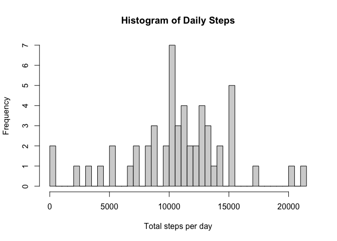
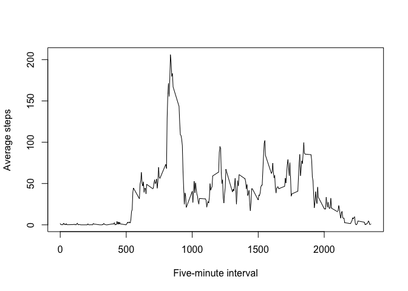
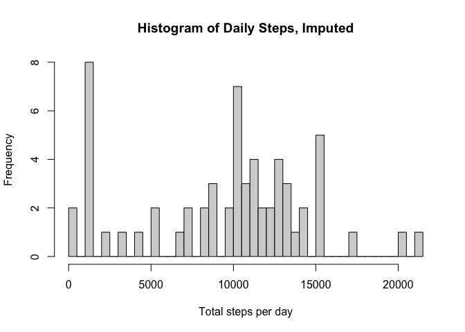
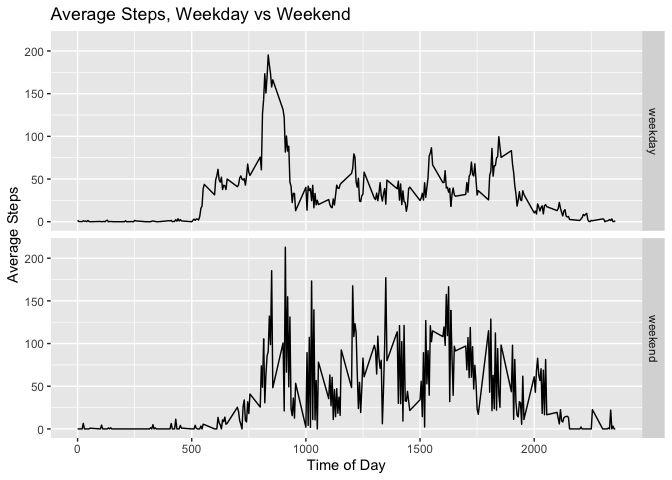

RepData\_PeerAssessment1
================
SaraGordon
5/24/2021

## Loading and preprocessing the data

Show any code that is needed to:  
- Load the data - Process/transform the data (if necessary)

``` r
if (!file.exists("data")) {dir.create("data")}
fileURL <- "https://d396qusza40orc.cloudfront.net/repdata%2Fdata%2Factivity.zip"
download.file(fileURL, destfile = "./data/Factivity.zip", method = "curl")
unzip("./data/Factivity.zip", exdir = "./data")

list.files("./data")
```

    ## [1] "activity.csv"  "Factivity.zip"

``` r
ActData <- read.csv("./data/activity.csv", sep = ",", header=TRUE)

##Change the date column to date class
ActData$date <- as.Date(ActData$date)
str(ActData)
```

    ## 'data.frame':    17568 obs. of  3 variables:
    ##  $ steps   : int  NA NA NA NA NA NA NA NA NA NA ...
    ##  $ date    : Date, format: "2012-10-01" "2012-10-01" ...
    ##  $ interval: int  0 5 10 15 20 25 30 35 40 45 ...

## What is total number of steps taken per day?

1.  Calculate the total number of steps per day

``` r
library(dplyr)
```

    ## 
    ## Attaching package: 'dplyr'

    ## The following objects are masked from 'package:stats':
    ## 
    ##     filter, lag

    ## The following objects are masked from 'package:base':
    ## 
    ##     intersect, setdiff, setequal, union

``` r
stepSum <- summarize(group_by(ActData, date), stepTotal=sum(steps))
```

1.  Make a histogram of the total number of steps per day

``` r
hist(stepSum$stepTotal, breaks = 60, main = "Histogram of Daily Steps", xlab = "Total steps per day")
```

<!-- -->

1.  Calculate and report the mean/median of the total number of steps
    per day

``` r
stepMean <- mean(stepSum$stepTotal, na.rm = TRUE)
stepMedian <- median(stepSum$stepTotal, na.rm = TRUE)
```

The mean of the total number of steps is 1.0766189^{4}.  
The median of the total number of steps is 10765.

## What is the average daily activity pattern?

1.  Make a time series plot of the 5-minute interval (x-axis) and the
    average number of steps taken, averaged across all days (y-axis)

``` r
dailySteps <- summarize(group_by(ActData, interval), avgSteps=mean(steps, na.rm=TRUE))

with(dailySteps, plot(interval, avgSteps, type = "l", ylab = "Average steps", xlab = "Five-minute interval"))
```

<!-- -->

1.  Which 5-minute interval, on average across all the days in the
    dataset, contains the maximum number of steps?

``` r
which.max(dailySteps$avgSteps)
```

    ## [1] 104

``` r
busiest <- dailySteps[104,]
intName <- busiest$interval
intAvg <- busiest$avgSteps
```

The interval with the highest average number of steps is 835, with
206.1698113 steps.

## Imputing missing values

1.  Calculate and report the total number of missing values in the
    dataset.

``` r
naSum <- sum(is.na(ActData))
naSum
```

    ## [1] 2304

1.  Devise a strategy for filling in all of the missing values in the
    dataset.

2.  Create a new dataset that is equal to the original but with the
    missing data filled in.

``` r
library(Hmisc)
```

    ## Loading required package: lattice

    ## Loading required package: survival

    ## Loading required package: Formula

    ## Loading required package: ggplot2

    ## 
    ## Attaching package: 'Hmisc'

    ## The following objects are masked from 'package:dplyr':
    ## 
    ##     src, summarize

    ## The following objects are masked from 'package:base':
    ## 
    ##     format.pval, units

``` r
NAData <- ActData

#Impute using mode function
ImpData <- NAData %>%
  group_by(interval) %>%
  mutate(steps = impute(steps, median))

#Detach Hmisc so it doesn't interfere with dplyr
detach("package:Hmisc", unload = TRUE)
```

4a. Make a histogram of the total number of steps taken each day.

``` r
ImpSum <- summarize(group_by(ImpData, date), stepTotal=sum(steps))

hist(ImpSum$stepTotal, breaks = 60, main = "Histogram of Daily Steps, Imputed", xlab = "Total steps per day")
```

<!-- -->

4b. Calculate and report the mean and median total number of steps taken
per day.

``` r
impMean <- mean(ImpSum$stepTotal)
impMedian <- median(ImpSum$stepTotal)
```

The mean of the total number of imputed steps is 9503.8688525.  
The median of the total number of imputed steps is 10395.

4c. Do these values differ from the estimates from the first part of the
assignment?

``` r
if (impMean == stepMean) {
  print("The mean number of steps from the imputed and not-imputed datasets is the same.")
} else if (impMean < stepMean) {
  print("The imputed mean is less than the not-imputed mean.")
} else if (impMean > stepMean) {
  print("The imputed mean is greater than the not-imputed mean.")
}
```

    ## [1] "The imputed mean is less than the not-imputed mean."

``` r
if (impMedian == stepMedian) {
  print("The median number of steps from the imputed and not-imputed datasets is the same.")
} else if (impMedian < stepMedian) {
  print("The imputed median is less than the not-imputed median.")
} else if (impMedian > stepMedian) {
  print("The imputed median is greater than the not-imputed median.")
}
```

    ## [1] "The imputed median is less than the not-imputed median."

4d. What is the impact of imputing missing data on the estimates of the
total daily number of steps?

``` r
ActStepSum <- sum(ActData$steps, na.rm = TRUE)
ImpStepSum <- sum(ImpData$steps)

if (ActStepSum == ImpStepSum) {
  print("The total number of steps from the imputed and not-imputed datasets is the same.")
} else if (ActStepSum < ImpStepSum) {
  print("The imputed step total is less than the not-imputed step total.")
} else if (ActStepSum > ImpStepSum) {
  print("The imputed step total is greater than the not-imputed step total.")
}
```

    ## [1] "The imputed step total is less than the not-imputed step total."

## Are there differences in activity patterns between weekdays and weekends?

1.  Create a new factor variable in the dataset with two levels –
    “weekday” and “weekend” – indicating whether a given date is a
    weekday or weekend day.

``` r
ImpData$dayName <- weekdays(ImpData$date)

weekdata <- subset(ImpData, dayName != c("Saturday", "Sunday"))
weekenddata <- subset(ImpData, dayName == c("Saturday", "Sunday"))

weekdata$dayType <- "weekday"
weekenddata$dayType <- "weekend"

ImpData2 <- rbind(weekdata, weekenddata)

ImpData2$dayType <- as.factor(ImpData2$dayType)
```

1.  Make a panel plot containing a time series plot of the 5-minute
    interval (x-axis) and the average number of steps taken, averaged
    across all weekday days or weekend days (y-axis).

``` r
library(ggplot2)
weekSteps <- summarize(group_by(ImpData2, interval, dayType), steps=mean(steps))
```

    ## `summarise()` has grouped output by 'interval'. You can override using the `.groups` argument.

``` r
ggplot(data=weekSteps, aes(x=interval, y=steps)) + facet_grid(dayType~.) + geom_line() + labs(title = "Average Steps, Weekday vs Weekend") + labs(x = "Time of Day") + labs(y = "Average Steps")
```

<!-- -->
